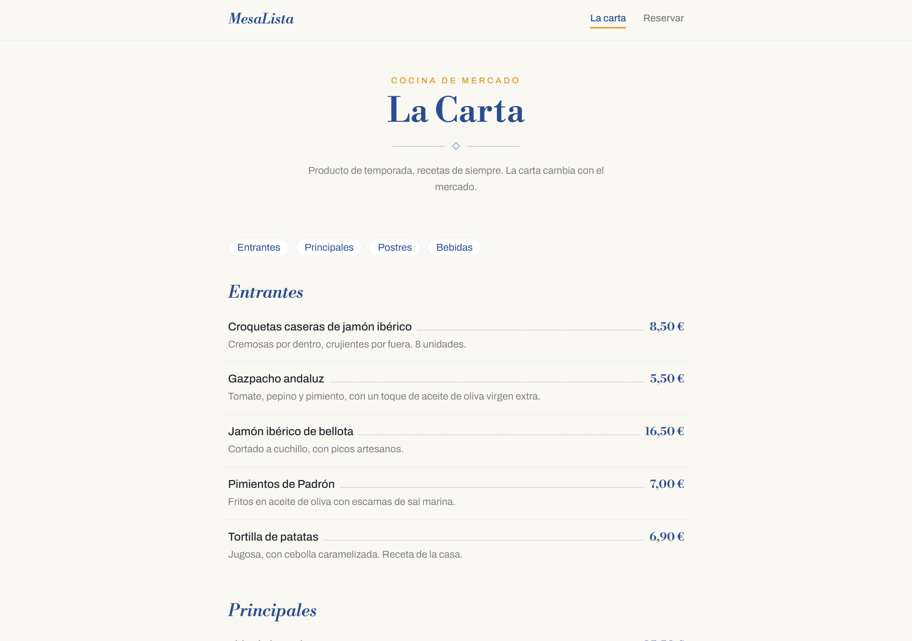
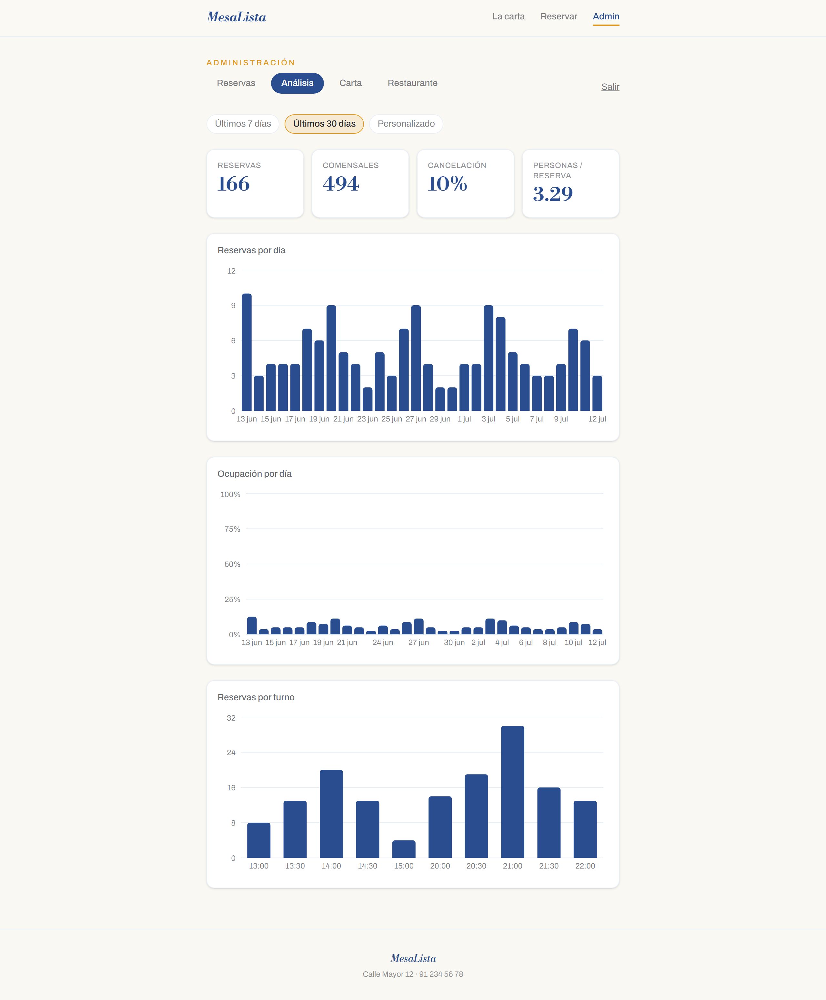

# MesaLista

_🇬🇧 [Read this in English](README.md)_

Sistema full-stack de reservas y carta para un restaurante: los clientes consultan la carta y reservan mesa; el propietario gestiona las reservas del día desde un panel de administración protegido.

**Demo en vivo:** [mesalista.vercel.app](https://mesalista.vercel.app) · **API:** [mesalista-76s8.onrender.com/api/menu](https://mesalista-76s8.onrender.com/api/menu)

> ⏱ La API corre en el plan gratuito de Render y se duerme tras un rato de inactividad — la primera petición puede tardar ~50 s en despertarla.



## Stack

| Capa | Tecnología | Por qué |
| --- | --- | --- |
| Frontend | React 18, TypeScript, Vite, Tailwind CSS v4 | Componentes tipados, feedback instantáneo en desarrollo, estilos utility-first sin archivo de configuración |
| Backend | Node.js, Express 5, TypeScript | Express 5 propaga los errores async de forma nativa — sin wrappers repetitivos |
| Base de datos | PostgreSQL (Supabase) + Prisma 7 | Consultas tipadas generadas desde un único esquema; migraciones como SQL revisable |
| Validación | Zod | Un esquema valida y tipa la entrada de cada endpoint; el formulario pinta los errores de campo que devuelve |
| Auth | JWT + bcryptjs | Sesiones sin estado para un panel de administrador único |
| Gráficas | Recharts | Gráficas declarativas en React para el panel de análisis |

## Decisiones técnicas

- **Disponibilidad real, a prueba de carreras.** Al reservar se busca la mesa libre *más pequeña* que quepa al grupo (una pareja nunca ocupa la mesa de 6) y la comprobación + inserción corren en una única transacción `Serializable` — dos peticiones compitiendo por la última mesa no pueden duplicar la reserva; la transacción perdedora reintenta una vez contra el nuevo estado. Un turno completo responde `409` con un mensaje que el formulario muestra bajo el campo de hora.
- **Prisma 7 con driver adapters.** Configuración del CLI en `prisma.config.ts`, cliente generado como TypeScript en `src/generated/`, conectando a través del driver estándar `pg`. Las migraciones usan la conexión directa de Supabase; la aplicación pasa por el transaction pooler.
- **El servidor es el único validador.** El cliente hace guardas de UX baratas (campos obligatorios, fecha mínima, selects que solo ofrecen valores válidos), pero cada regla vive en Zod en el servidor, y las respuestas 400/409 llevan mensajes por campo que el formulario pinta directamente.
- **Panel de administración protegido con JWT.** Credenciales con hash bcrypt, 401 idéntico para email o contraseña incorrectos (sin enumeración de usuarios), tokens de 12 horas y middleware `requireAuth` a nivel de ruta — la guarda de ruta del cliente es UX, no seguridad.

## Panel de análisis

El panel de administración incluye un dashboard de negocio (`/admin/dashboard`): cifras clave, reservas por día, ocupación por día y reservas por turno, todo gobernado por un selector de rango de fechas.



**Endpoints** (todos tras el middleware JWT, todos con `?from=AAAA-MM-DD&to=AAAA-MM-DD`):

- `GET /api/stats/summary` — totales: reservas, comensales, tasa de cancelación, personas por reserva
- `GET /api/stats/daily` — reservas + comensales por día (con días a cero incluidos para las gráficas)
- `GET /api/stats/hours` — reservas agrupadas por turno
- `GET /api/stats/occupancy` — mesas-turno ocupadas frente a capacidad, por día

**Decisiones técnicas:**

- **Toda la agregación ocurre en PostgreSQL** vía `groupBy`/`aggregate` de Prisma — la API devuelve resultados de tamaño constante (3 filas de estado, ≤366 filas de días) da igual cuánto histórico exista, en lugar de enviar N reservas para contarlas en JS.
- **La ocupación es la lógica de disponibilidad al revés:** capacidad = mesas × turnos, y cada reserva activa consume exactamente una mesa-turno — la misma invariante que garantiza la transacción de reserva, así que la ocupación no puede superar el 100%.
- **La librería de gráficas nunca llega a los visitantes:** la ruta del dashboard se carga con lazy loading, así que Recharts viaja en su propio chunk (~356 kB) que solo se descarga tras iniciar sesión como admin.

## Ejecutarlo en local

Requiere Node 20+ y una base de datos PostgreSQL (plan gratuito de [Supabase](https://supabase.com) o [Neon](https://neon.tech)).

```bash
# 1. API
cd server
npm install
cp .env.example .env   # rellena las URLs de la base de datos, el secreto JWT y las credenciales de admin
npx prisma migrate dev # crea las tablas
npx prisma db seed     # datos de la carta, mesas y el usuario admin
npm run dev            # http://localhost:3001

# 2. Frontend (segunda terminal)
cd client
npm install
npm run dev            # http://localhost:5173
```

Panel de administración en `/admin` — entra con el `ADMIN_EMAIL` / `ADMIN_PASSWORD` que pusiste en `server/.env`.

## Qué mejoraría con más tiempo

- **Tests.** Vitest + Supertest sobre las tres cosas que lo merecen: los casos límite de la lógica de disponibilidad, la validación de entrada de reservas y el middleware de auth.
- **Emails de confirmación** cuando el propietario confirma una reserva (Resend).
- **Vista semanal** en el panel de administración; hoy es día a día.
- **Un paquete de tipos compartido.** Los tipos del cliente y los turnos horarios están duplicados a mano desde el servidor — aceptable a este tamaño, pero la próxima funcionalidad que toque ambos lados paga el precio de `npm workspaces`.
- **Fotos de los platos** y una pasada de diseño visual.
- Aviso conocido: `npm audit` señala `@prisma/dev` (una dependencia del servidor de base de datos local del CLI de Prisma, `prisma dev`) — herramienta que no usamos; el runtime desplegado no está afectado. En seguimiento hasta que haya release parcheada del CLI.
